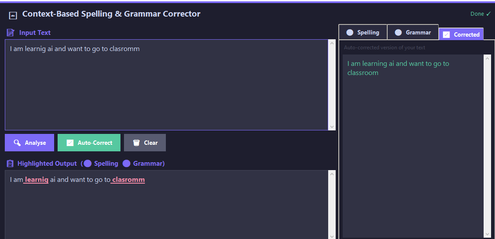

# ✍️ Spell & Grammar Corrector (NLP)

A context-aware text analysis tool that identifies spelling errors and grammatical inconsistencies using **Natural Language Processing (NLP)**.
This project features a modern dark-themed GUI and leverages both statistical models and character-level algorithms.

---

## 🌟 Key Features

* **Contextual Correction**
  Uses an N-gram frequency model trained on the `big.txt` corpus (Project Gutenberg).

* **Intelligent Spelling**
  Implements the **Levenshtein Distance** algorithm for character-level similarity.

* **Grammar Insights**
  Utilizes **NLTK Part-of-Speech (POS) tagging** to detect structural issues.

* **Modern UI**
  A sleek, user-friendly interface built with `tkinter` featuring a dark theme.

---

## 🛠️ Installation & Setup

### 1️⃣ Clone the Repository

```bash
git clone https://github.com/MalaikaAkhtar01/spell-grammar-corrector.git
cd spell-grammar-corrector
```

### 2️⃣ Install Required Libraries

```bash
pip install pyspellchecker nltk
```

### 3️⃣ Run the Application

```bash
python spell_grammar_corrector_v2.py
```

> **Note:** On first launch, required NLTK datasets (`punkt`, `brown`, `words`, etc.) will be downloaded automatically.

---

## 📂 Project Structure

```text
spell_grammar_corrector_v2.py   # Main Python script (NLP logic + GUI)
big.txt                         # Dataset for training frequency model
```

---

## 📸 Screenshots

### 🖥️ Main Interface




---

## 🤝 Contributors

* **Malaika Akhtar** (@MalaikaAkhtar01)
* **Haleema Sadia**
* **Sadia Mazhar**

---

## 📜 Credits

The `big.txt` dataset is sourced from public domain literature provided by **Project Gutenberg**.
